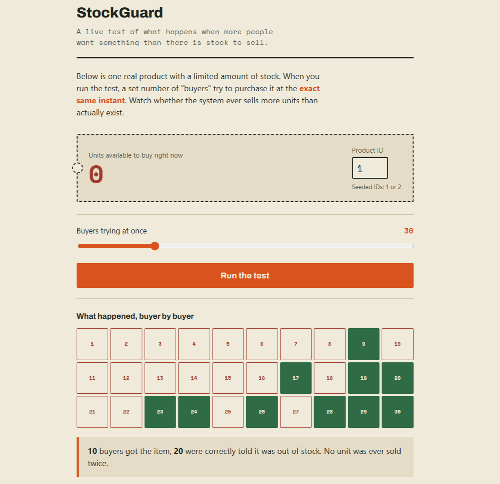

# StockGuard

A concurrent inventory reservation service built to solve one specific
problem correctly: preventing overselling when multiple users try to buy
the same limited-stock item at the same time.

**Live demo:** https://stockguard-4wn3.onrender.com/index.html
*(free-tier hosting — first request may take 30-60s to wake up)*



## The problem

When stock is low and demand is high, two requests can both read
"1 item left," both think it's safe to proceed, and both succeed —
selling the same item twice. StockGuard prevents this at the database
level using row-level locking, so it holds up even under real concurrent
load, not just in theory.

## Features

- **Race-condition-safe reservations** — `SELECT ... FOR UPDATE` row
  locking on the inventory table guarantees exactly the available stock
  is sold, never more, even under simultaneous requests.
- **Idempotent reservation creation** — safe to retry a request (network
  blip, double-click) without double-booking stock, enforced by an
  idempotency key plus a database unique constraint as a safety net.
- **Cache-aside product reads** — Redis-backed `GET /products/{id}` with
  automatic invalidation on stock changes.
- **Asynchronous reservation expiry** — unconfirmed reservations
  automatically expire and release their stock via a RabbitMQ delayed
  message pattern, decoupled from the request/response cycle.
- **Live concurrency demo** — a browser page that fires 50 simultaneous
  purchase attempts and visualizes which succeed and which get correctly
  rejected, in real time.
- **Load tested** — verified with k6 under 100 concurrent requests
  against a low-stock product.

## Architecture

```
Client (browser / curl)
        │
        ▼
Spring Boot REST API ──────▶ Redis (product cache)
        │
        ▼
PostgreSQL (products, inventory, reservations)
        │
        ▼
RabbitMQ (delayed reservation-expiry queue)
        │
        ▼
Background worker (expires unconfirmed reservations, releases stock)
```

## Tech stack

| Layer | Technology |
|---|---|
| Language / Framework | Java 17, Spring Boot 3 |
| Database | PostgreSQL |
| Cache | Redis |
| Message queue | RabbitMQ (hosted on CloudAMQP) |
| Deployment | Docker, Render |
| Load testing | k6 |
| Testing | JUnit 5, Mockito, Testcontainers |

## API

| Method | Endpoint | Description |
|---|---|---|
| `POST` | `/products` | Create a product with initial stock |
| `GET` | `/products/{id}` | Get product + stock (Redis cache-aside) |
| `POST` | `/reservations` | Reserve stock — requires `Idempotency-Key` header |
| `GET` | `/reservations/{id}` | Get a reservation's status |
| `POST` | `/reservations/{id}/confirm` | Confirm a pending reservation |
| `POST` | `/reservations/{id}/cancel` | Cancel a pending reservation, release stock |

## Running locally

Requires Docker and Java 17+.

```bash
git clone https://github.com/krishnasinghcode/stockguard.git
cd stockguard

# start Postgres, Redis, and RabbitMQ
docker compose up -d postgres redis rabbitmq

# run the app
mvn spring-boot:run
```

Open `http://localhost:8080/index.html` for the live demo, or:

```bash
curl http://localhost:8080/products/1
```

RabbitMQ's management dashboard is available at `http://localhost:15672`
(login `guest` / `guest`) — useful for watching messages move through the
delayed-expiry queue.

### Running tests

```bash
mvn test
```

The concurrency test (`ConcurrentReservationTest`) spins up a real
Postgres instance via Testcontainers and fires 50 simultaneous reservation
requests against a product with 10 units of stock, asserting exactly 10
succeed and the final stock is never negative.

## Load test results

Run against the live Render deployment with k6, 100 concurrent requests
against a product seeded with 10 units of stock:

```
Success: 10
Out of stock: 90
p95 latency: ~18.8s (free-tier hosting)
p99 latency: ~19.0s (free-tier hosting)
```

**0% overselling** under concurrent load — the core guarantee this
project set out to prove. Latency reflects free-tier shared compute
across the app, database, and message broker rather than the locking
mechanism itself.

See `k6/load-test.js` to reproduce.
